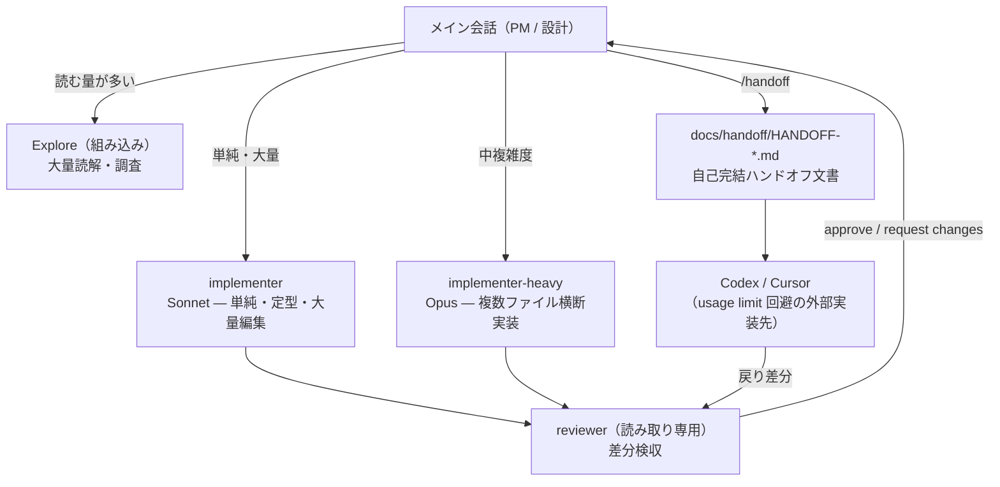

# Claude Code Multi-Agent Workflow

> **Status**: experimental, locally tested template. Not an official Anthropic / OpenAI project.

> **EN** — A portable multi-agent development workflow template for Claude Code.
> The main session acts as PM/architect and routes work by complexity: simple bulk edits go to a
> Sonnet subagent, multi-file implementation to an Opus subagent, acceptance review to a
> read-only reviewer agent, and overflow work to external tools (Codex / Cursor) via
> self-contained Markdown handoff documents. Built on three principles: subagents are for
> context-pollution control (not for everything), context is shared through files (not chat
> memory), and expensive models are reserved for high-leverage work. The template itself was
> tested with an adversarial multi-agent review (18 findings → 6 fixes) and per-agent smoke tests.

## English overview

This repository packages a practical workflow for using Claude Code as a coordinating agent rather than a single all-purpose worker.
It separates planning, implementation, review, and cross-tool handoff while keeping the shared context in Markdown files.

What it provides:

- **Claude Code subagents** for simple implementation, heavier multi-file implementation, and acceptance review
- **Slash commands** for codebase analysis, phase-based implementation, diff review, and handoff document generation
- **File-based context sharing** through `docs/refactor-plan.md` and `docs/handoff/HANDOFF-*.md`
- **Codex / Cursor handoff support** through self-contained Markdown task documents and `AGENTS.md`
- **Safety-oriented defaults**: small diffs, no unnecessary subagent use, reviewer-based acceptance checks, and explicit limitations

Use this template when a coding task is large enough that dumping all research, planning, implementation, and review into one chat would pollute the main context.
For small fixes or one-off questions, the main session should handle the task directly.

Claude Code 用のマルチエージェント分業ワークフロー・テンプレートです。
メインセッション（PM / 設計役）が作業の複雑度を判断し、実装・検収・外部ツールへルーティングします。

## 設計思想（3原則）

1. **サブエージェントはコンテキスト汚染対策** — 万能戦略ではない。大量のファイル読解・ログ・検索結果でメイン文脈が汚れる作業だけを切り出し、短いタスク・小修正には使わない
2. **文脈はファイルで共有する** — 調査結果・計画・実装指示は会話内ではなく `docs/` 配下の Markdown に固定する。チャットのメモリに依存しないため、Codex / Cursor・別セッション・人間とそのまま共有できる
3. **高価なモデルは高付加価値工程に集中** — 実装を安価なモデルへ渡すのは能力不足のためではなく、PM・設計・検収に上位モデルを温存する費用対効果の設計

## アーキテクチャ



### PM ルーティング表

| 作業 | 担当 |
|---|---|
| 大量のファイル読解・コードベース調査 | Explore（組み込みサブエージェント） |
| 実装計画・設計 | プランモード or Plan（組み込み） |
| 単純・定型・大量の編集（lint、型エラー、リネーム） | implementer（Sonnet） |
| 複数ファイル横断・中複雑度の実装 | implementer-heavy（Opus） |
| 設計判断が重い実装・アーキテクチャ変更 | メイン会話が続投 |
| usage limit が近い / 長時間の定型実装 | `/handoff` で Codex / Cursor へ切り出し |
| 差分レビュー・他ツール実装の検収 | reviewer |

## 構成

```
claude/
├── agents/
│   ├── implementer.md        # Sonnet 固定・単純大量編集（最小差分・挙動変更禁止）
│   ├── implementer-heavy.md  # Opus 固定・複数ファイル横断（Phase 単位・小 PR 粒度）
│   └── reviewer.md           # 読み取り専用・Bash 検査系限定・approve/request changes 判定
├── commands/
│   ├── analyze-codebase.md   # 編集禁止の調査 → docs/refactor-plan.md に Phase 計画を保存
│   ├── implement-phase.md    # PM ルーティング → 実装 → reviewer 検収まで一連
│   ├── review-diff.md        # reviewer 起動（他ツール戻り差分の検収兼用）
│   └── handoff.md            # Codex/Cursor 向け自己完結ハンドオフ文書を生成
└── rules/
    └── agent-workflow.md     # ルーティング表・運用ルール・検収必須範囲
```

## インストール

`claude/` 配下を `~/.claude/` にコピーします。

```powershell
Copy-Item -Recurse -Force .\claude\agents\*   "$env:USERPROFILE\.claude\agents\"
Copy-Item -Recurse -Force .\claude\commands\* "$env:USERPROFILE\.claude\commands\"
Copy-Item -Recurse -Force .\claude\rules\*    "$env:USERPROFILE\.claude\rules\"
```

グローバル `~/.claude/CLAUDE.md` の末尾に2行追記します。

```markdown
## Agent Workflow — PMルーティングとクロスツール分業
Global workflow rules: @rules/agent-workflow.md
```

> 注: モデル指定は full model ID（`claude-sonnet-4-6` / `claude-opus-4-8`）を使用しています。
> 環境でエラーになる場合は各 agent の `model:` を alias（`sonnet` / `opus`）に変更してください。

## 使い方

基本フロー（詳細は [docs/usage.md](docs/usage.md)）:

```text
/analyze-codebase          # 調査と Phase 分け計画（コード編集なし）
/implement-phase 1         # PM が担当を判断 → 実装 → reviewer 検収
/review-diff               # 任意の差分を検収（他ツール戻り差分にも）
/handoff <topic>           # Codex/Cursor へ渡す自己完結文書を生成
```

## 検証プロセス

このテンプレート自体を、読み取り専用エージェント3体による敵対的レビューで検証しています
（findings 18件 → 採用修正6件: 空引数対策・Windows-safe slug 正規化・巨大ツリー走査ガード・
自動委任ガード・グローバルルールとの矛盾解消・検収必須範囲の明確化）。
各エージェントは極小・読み取り専用タスクによるスモークテストに合格済みです。
詳細は [docs/design.md](docs/design.md) を参照してください。

## 制限事項

- reviewer の Bash 制約はプロンプトレベルであり、完全な権限分離ではない（不安定なら `tools` から Bash を除去し、テスト実行はメイン会話側へ）
- `commands/` は後方互換の legacy 形式（将来的には `skills/` への移行候補）
- 外部ツール（Codex / Cursor）側の AGENTS.md・ハンドオフ文書の解釈は各ツールの仕様に依存

## Roadmap

- [x] Claude Code subagent workflow
- [x] Markdown handoff for Codex / Cursor
- [ ] Codex CLI での実運用検証
- [x] Codex CLI の MCP サーバー化 — Phase 1（read-only `codex_plan`）を [codex-cli-mcp-bridge](https://github.com/0x000x7f/codex-cli-mcp-bridge) として実装・検証済み（計画: [docs/codex-mcp-plan.md](docs/codex-mcp-plan.md)）
- [ ] クロスエージェント自動レビューループ
- [ ] usage limit の自律ハンドオフ（codex-handoff）の repo 化・多機体展開（計画: [docs/codex-handoff-plan.md](docs/codex-handoff-plan.md)）
- [ ] `~/.claude` 設定の機体間同期 — 専用 dotfiles repo に集約し、本 repo はそのコンポーネントとして co-evolve（計画: [docs/config-sync-plan.md](docs/config-sync-plan.md)）

> 本リポジトリは、将来的に `~/.claude` 全体を管理する dotfiles repo の1コンポーネントとなる想定です。
> agents / commands / rules の source of truth は本リポジトリに置き続けます。詳細は
> [docs/config-sync-plan.md](docs/config-sync-plan.md) を参照。

## Related project

- [codex-cli-mcp-bridge](https://github.com/0x000x7f/codex-cli-mcp-bridge) —
  `/handoff` 文書の手動運搬を自動化する実験的 MCP ブリッジ。Codex CLI を読み取り専用ツール
  （`codex_plan`）として Claude Code から呼び出す。本テンプレートの Markdown handoff 方式は
  ブリッジのフォールバックとして維持される

## License

[MIT](LICENSE)
